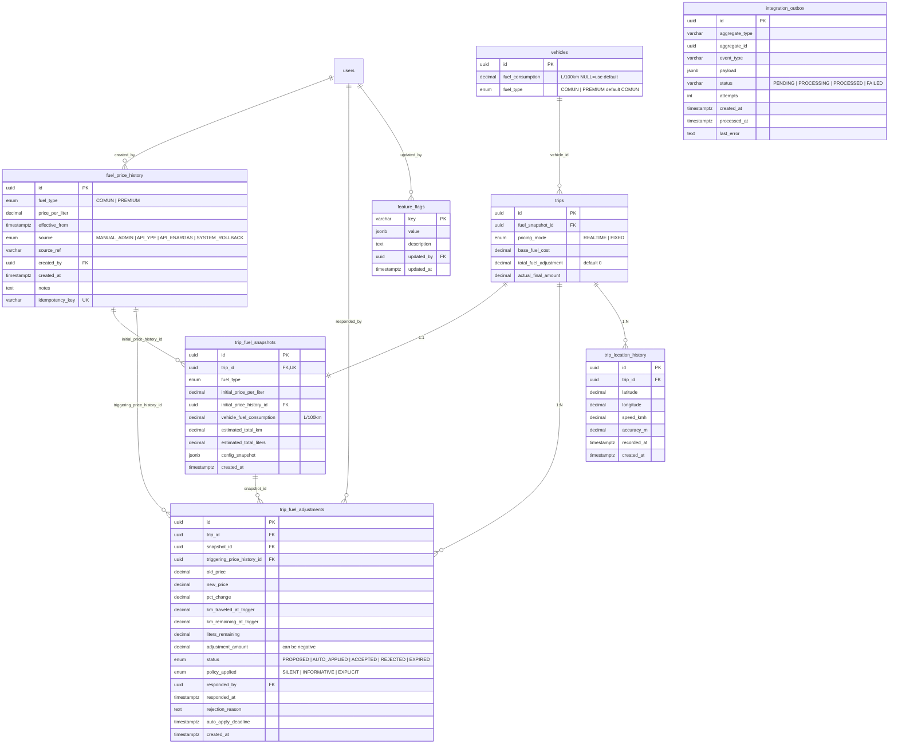

# ERD — Fuel Tracking

## Diagrama (mermaid)



## Tablas nuevas

### `fuel_price_history` (append-only)

| Columna | Tipo | Nulo | Descripción |
|---|---|---|---|
| `id` | UUID | NO | PK |
| `fuel_type` | `fuel_type_enum` | NO | COMUN, PREMIUM |
| `price_per_liter` | DECIMAL(10,2) | NO | CHECK > 0 |
| `effective_from` | TIMESTAMPTZ | NO | cuándo entra en vigor |
| `source` | `fuel_source_enum` | NO | default MANUAL_ADMIN |
| `source_ref` | VARCHAR(255) | SÍ | ej: "Resolución YPF #123", "YPF API 2026-04-17T10:00" |
| `created_by` | UUID | NO | FK users(id) |
| `created_at` | TIMESTAMPTZ | NO | default NOW() |
| `notes` | TEXT | SÍ | razón del cambio |
| `idempotency_key` | VARCHAR(255) | SÍ | UNIQUE — evita duplicados |

**Índices:**
- PK(id)
- UNIQUE(idempotency_key) WHERE idempotency_key IS NOT NULL
- INDEX(fuel_type, effective_from DESC) — para "current price by type"
- BRIN(effective_from) — series temporales, muy barato

**Reglas:**
- `INSERT` únicamente. Nunca UPDATE ni DELETE en prod (trigger opcional para bloquear).

### `trip_fuel_snapshots`

| Columna | Tipo | Nulo | Descripción |
|---|---|---|---|
| `id` | UUID | NO | PK |
| `trip_id` | UUID | NO | FK trips(id) ON DELETE CASCADE, UNIQUE |
| `fuel_type` | `fuel_type_enum` | NO | copiado del vehicle al momento |
| `initial_price_per_liter` | DECIMAL(10,2) | NO | snapshot del precio |
| `initial_price_history_id` | UUID | NO | FK fuel_price_history(id) — trazabilidad |
| `vehicle_fuel_consumption` | DECIMAL(6,2) | NO | L/100km usado (resuelto con fallback) |
| `estimated_total_km` | DECIMAL(10,2) | NO | Google Directions |
| `estimated_total_liters` | DECIMAL(10,2) | NO | km × consumo / 100 |
| `config_snapshot` | JSONB | NO | toda la config: consumo, precio, policy thresholds, feature flags |
| `created_at` | TIMESTAMPTZ | NO | default NOW() |

**Índices:**
- PK(id)
- UNIQUE(trip_id)

### `trip_fuel_adjustments`

| Columna | Tipo | Nulo | Descripción |
|---|---|---|---|
| `id` | UUID | NO | PK |
| `trip_id` | UUID | NO | FK trips(id) ON DELETE CASCADE |
| `snapshot_id` | UUID | NO | FK trip_fuel_snapshots(id) |
| `triggering_price_history_id` | UUID | NO | FK fuel_price_history(id) |
| `old_price` | DECIMAL(10,2) | NO | precio previo |
| `new_price` | DECIMAL(10,2) | NO | precio nuevo |
| `pct_change` | DECIMAL(6,4) | NO | (new - old) / old |
| `km_traveled_at_trigger` | DECIMAL(10,2) | NO | km GPS al momento |
| `km_remaining_at_trigger` | DECIMAL(10,2) | NO | total - traveled |
| `liters_remaining` | DECIMAL(10,2) | NO | km_remaining × consumo / 100 |
| `adjustment_amount` | DECIMAL(10,2) | NO | puede ser NEGATIVO |
| `status` | `adjustment_status_enum` | NO | default PROPOSED |
| `policy_applied` | `adjustment_policy_enum` | NO | SILENT, INFORMATIVE, EXPLICIT |
| `responded_by` | UUID | SÍ | FK users(id) |
| `responded_at` | TIMESTAMPTZ | SÍ | |
| `rejection_reason` | TEXT | SÍ | si REJECTED |
| `auto_apply_deadline` | TIMESTAMPTZ | SÍ | si INFORMATIVE/EXPLICIT con ventana |
| `created_at` | TIMESTAMPTZ | NO | default NOW() |

**Índices:**
- PK(id)
- INDEX(trip_id, status)
- INDEX(auto_apply_deadline) WHERE status='PROPOSED' — para cron de expiración
- INDEX(triggering_price_history_id) — para audit "qué ajustes generó el cambio X"

### `trip_location_history`

| Columna | Tipo | Nulo | Descripción |
|---|---|---|---|
| `id` | UUID | NO | PK |
| `trip_id` | UUID | NO | FK trips(id) ON DELETE CASCADE |
| `latitude` | DECIMAL(10,7) | NO | |
| `longitude` | DECIMAL(10,7) | NO | |
| `speed_kmh` | DECIMAL(6,2) | SÍ | si el device lo provee |
| `accuracy_m` | DECIMAL(8,2) | SÍ | precisión GPS |
| `recorded_at` | TIMESTAMPTZ | NO | timestamp del device |
| `created_at` | TIMESTAMPTZ | NO | timestamp del server |

**Índices:**
- PK(id)
- INDEX(trip_id, recorded_at)

**Retención:** 90 días. Partition por mes recomendado si el volumen escala.

### `integration_outbox`

| Columna | Tipo | Nulo | Descripción |
|---|---|---|---|
| `id` | UUID | NO | PK |
| `aggregate_type` | VARCHAR(100) | NO | ej: 'fuel_price', 'trip' |
| `aggregate_id` | UUID | NO | id del aggregate raíz |
| `event_type` | VARCHAR(100) | NO | ej: 'fuel.price.changed' |
| `payload` | JSONB | NO | datos del evento |
| `status` | VARCHAR(20) | NO | PENDING, PROCESSING, PROCESSED, FAILED |
| `attempts` | INT | NO | default 0 |
| `created_at` | TIMESTAMPTZ | NO | default NOW() |
| `processed_at` | TIMESTAMPTZ | SÍ | |
| `last_error` | TEXT | SÍ | |

**Índices:**
- PK(id)
- INDEX(status, created_at) WHERE status='PENDING' — hot path del worker
- INDEX(aggregate_type, aggregate_id) — debugging

### `feature_flags`

| Columna | Tipo | Nulo | Descripción |
|---|---|---|---|
| `key` | VARCHAR(100) | NO | PK |
| `value` | JSONB | NO | boolean o struct según flag |
| `description` | TEXT | SÍ | |
| `updated_by` | UUID | SÍ | FK users(id) |
| `updated_at` | TIMESTAMPTZ | NO | default NOW() |

**Flags iniciales:**
- `FUEL_TRACKING_ENABLED`: `false`
- `FUEL_AUTO_APPLY_ENABLED`: `false`
- `FUEL_ROLLOUT_PCT`: `0`

## Enums nuevos

```sql
CREATE TYPE fuel_type_enum AS ENUM ('COMUN', 'PREMIUM');

CREATE TYPE fuel_source_enum AS ENUM (
  'MANUAL_ADMIN',
  'API_YPF',        -- reservado V2
  'API_ENARGAS',    -- reservado V2
  'SYSTEM_ROLLBACK' -- si admin revierte un cambio
);

CREATE TYPE adjustment_status_enum AS ENUM (
  'PROPOSED',
  'AUTO_APPLIED',
  'ACCEPTED',
  'REJECTED',
  'EXPIRED'
);

CREATE TYPE adjustment_policy_enum AS ENUM (
  'SILENT',
  'INFORMATIVE',
  'EXPLICIT'
);

CREATE TYPE pricing_mode_enum AS ENUM (
  'FIXED',
  'REALTIME'
);
```

## Alteraciones a tablas existentes

### `vehicles`

```sql
ALTER TABLE vehicles
  ADD COLUMN fuel_consumption DECIMAL(6,2) CHECK (fuel_consumption IS NULL OR (fuel_consumption > 0 AND fuel_consumption < 200)),
  ADD COLUMN fuel_type fuel_type_enum NOT NULL DEFAULT 'COMUN';
```

Range 0-200 L/100km es el sanity check (un bitren cargado extremo ~60, motores enormes llegan a 80).

### `trips`

```sql
ALTER TABLE trips
  ADD COLUMN fuel_snapshot_id UUID REFERENCES trip_fuel_snapshots(id),
  ADD COLUMN pricing_mode pricing_mode_enum NOT NULL DEFAULT 'REALTIME',
  ADD COLUMN base_fuel_cost DECIMAL(10,2),
  ADD COLUMN total_fuel_adjustment DECIMAL(10,2) NOT NULL DEFAULT 0,
  ADD COLUMN actual_final_amount DECIMAL(10,2);
```

Relación circular `trips.fuel_snapshot_id ↔ trip_fuel_snapshots.trip_id`:
- Crear snapshot primero con `trip_id` set
- Luego UPDATE `trips.fuel_snapshot_id` con el snapshot.id
- En migración, ambas FKs se crean como DEFERRABLE o se crea el snapshot en un step posterior

## Consideraciones PostgreSQL

- **CHECK constraints** en decimales para evitar valores imposibles
- **PARTIAL UNIQUE INDEX** en `idempotency_key WHERE NOT NULL` (NULL no debe tokenizar unique)
- **Enums extensibles**: PostgreSQL permite `ALTER TYPE ... ADD VALUE` sin migration completa
- **Timestamps TZ-aware**: todo con `TIMESTAMPTZ`, no `TIMESTAMP`
- **JSONB** sobre JSON para `config_snapshot`, `payload` (indexable, eficiente)
- **BRIN** en series temporales vs BTREE — 1000x más barato en espacio

## Retention jobs (cron)

```sql
-- Diariamente:
DELETE FROM trip_location_history
WHERE recorded_at < NOW() - INTERVAL '90 days';

DELETE FROM integration_outbox
WHERE status = 'PROCESSED'
  AND processed_at < NOW() - INTERVAL '30 days';

-- fuel_price_history NUNCA se borra en prod.
```
