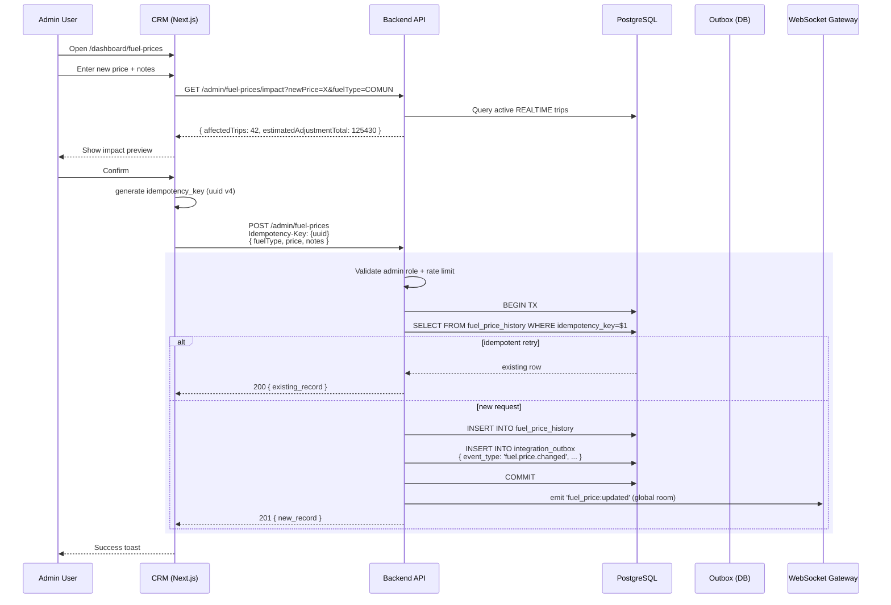
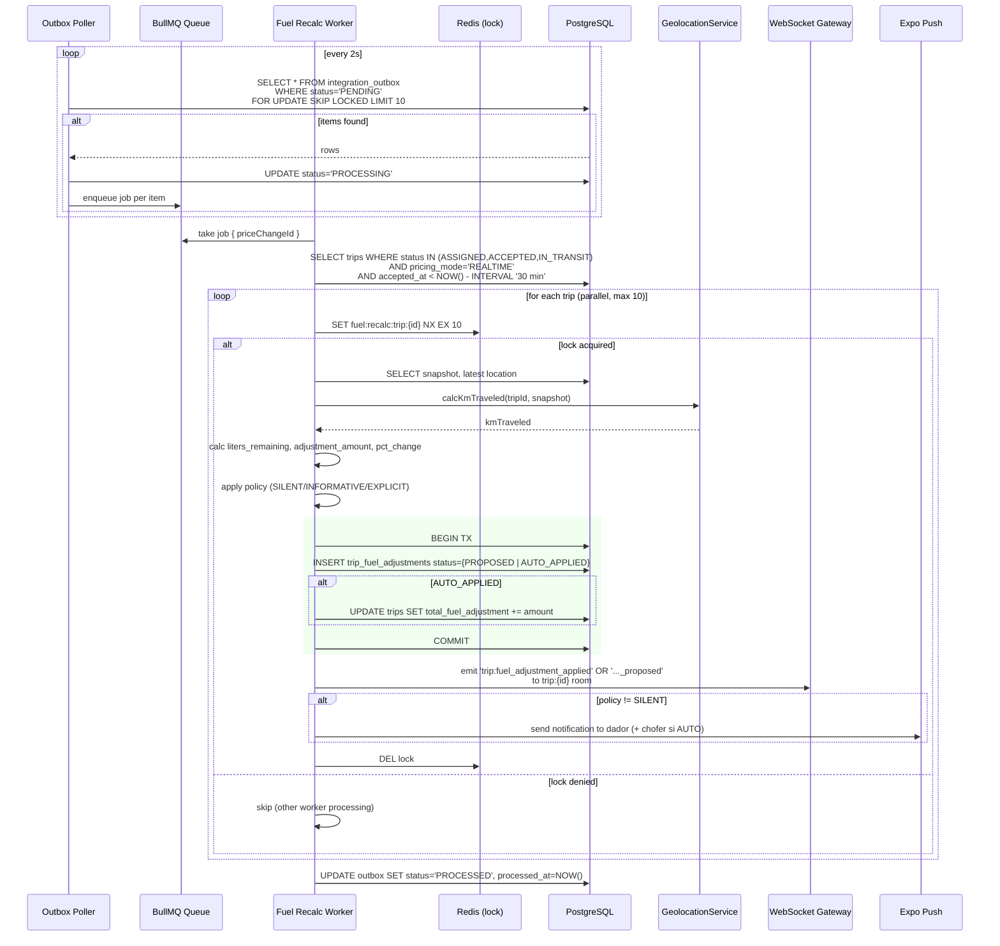
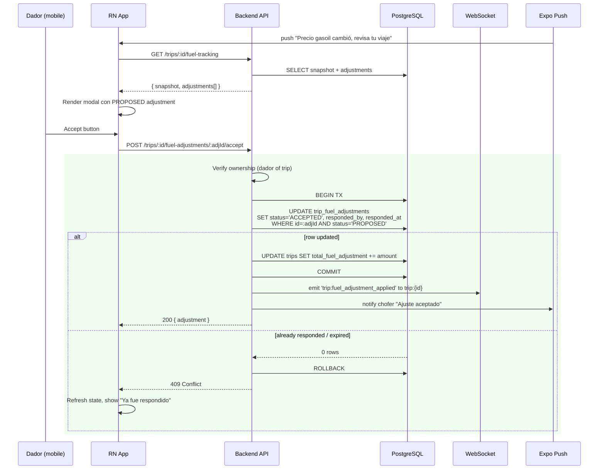
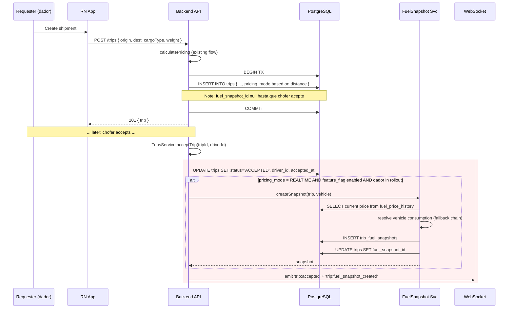
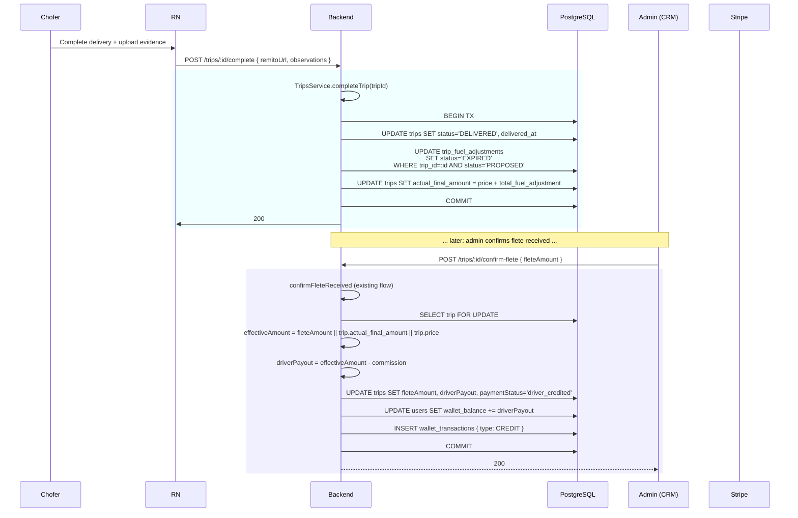
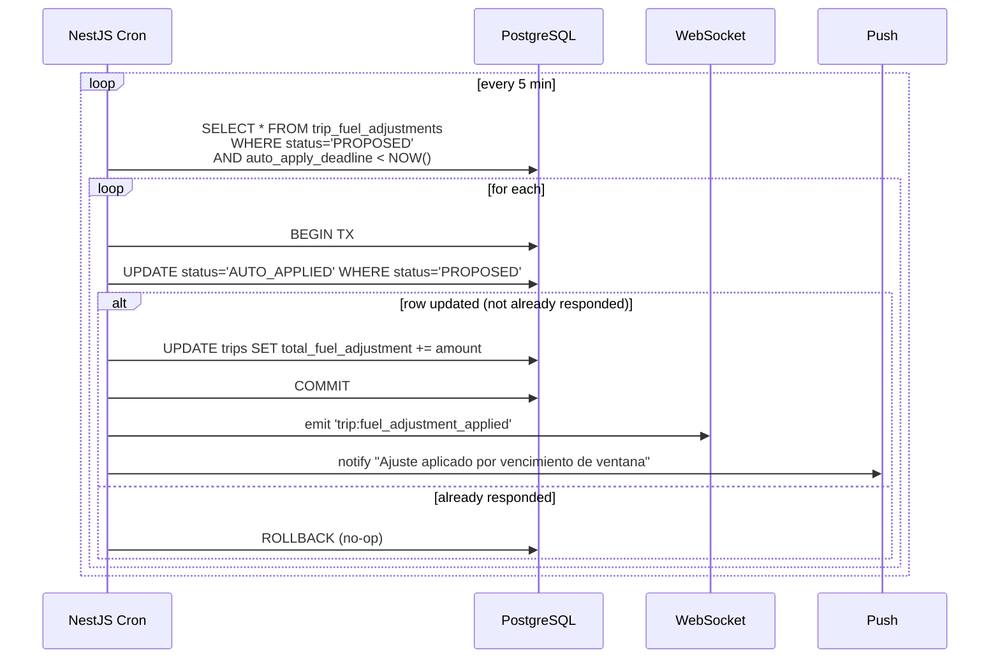
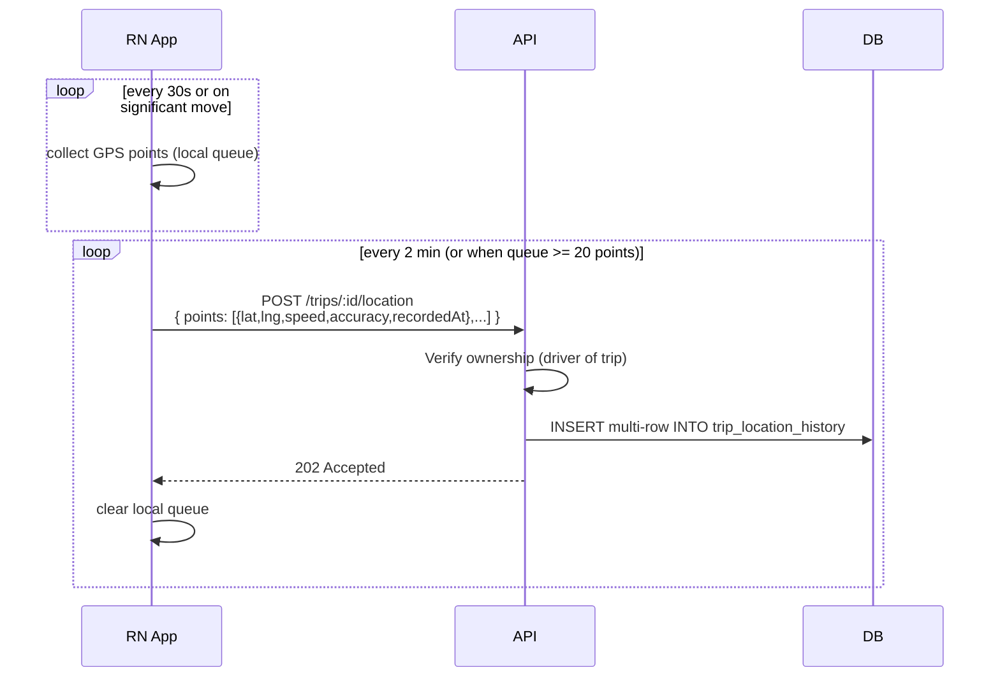
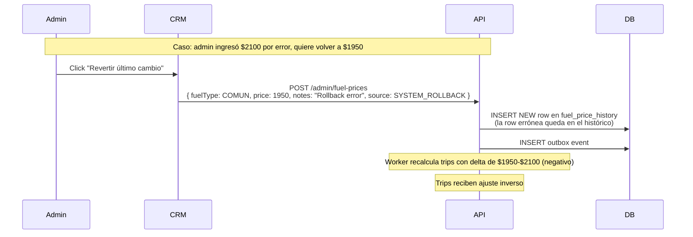

# Sequence Diagrams — Fuel Tracking

## 1. Registro de cambio de precio (admin)

## 2. Propagación async a trips activos

## 3. Dador responde ajuste PROPOSED

## 4. Creación de trip y snapshot

## 5. Cierre de viaje y liquidación

## 6. Cron de expiración de PROPOSED

## 7. GPS upload batch (mobile)

## 8. Admin revierte un cambio (rollback manual)

## Notas sobre los flujos

1. **Todos los flujos son idempotentes** en puntos críticos (POST admin, accept adjustment, complete trip).
2. **Locks pesimistas** en trips y wallet se mantienen según el patrón actual del código.
3. **Outbox polling** con `FOR UPDATE SKIP LOCKED` permite múltiples pollers seguros en cluster.
4. **BullMQ jobs** tienen retry con backoff exponencial (3s, 15s, 60s) y DLQ.
5. **WebSocket events** se emiten **fuera** de la transacción (pueden fallar sin afectar consistencia de datos).
6. **Push notifications** son best-effort, no bloquean ni revierten.
